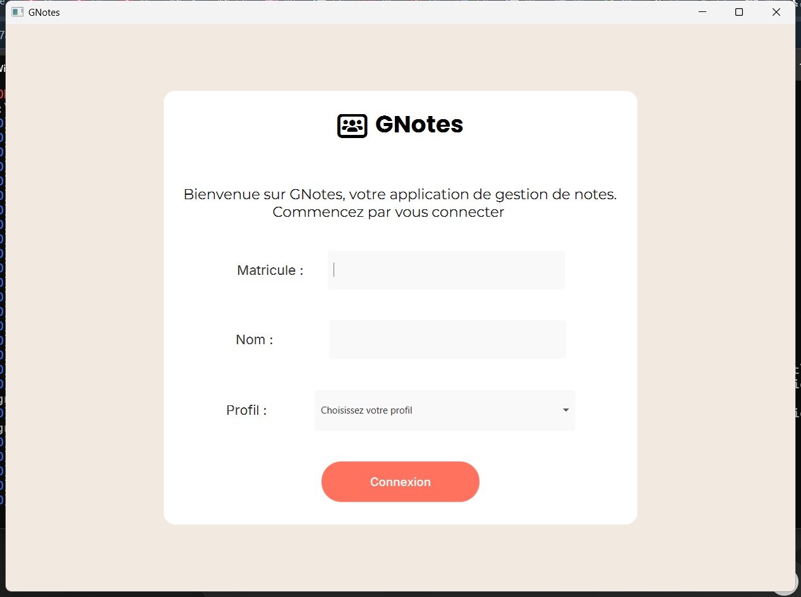
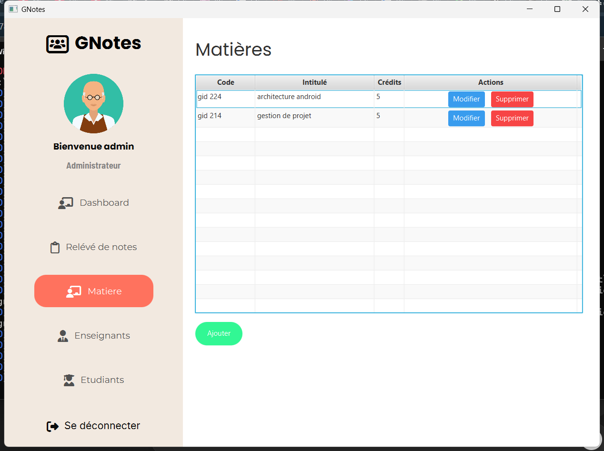

# 🎓 GNotes - Student Grades Management System

GNotes is a desktop application developed in Java for managing students and their grades. It provides a user-friendly interface to add, edit, and view student records, while storing all data in a MySQL database.

## ✨ Features

- 👨‍🎓 Add, edit, and delete students  
- 📝 Manage students’ grades efficiently  
- 📊 View and organize academic results  
- 🗄️ Persistent data storage using MySQL  
- 🖥️ Graphical interface built with JavaFX

## 🛠️ Tech Stack

- Java  
- Maven  
- JavaFX  
- MySQL  
- JDBC

## 🏗️ Project Structure

- **Maven** for dependency management  
- **JavaFX** for the GUI  
- **MySQL** database exported as `universite.sql` (included in the repo)  
- **JDBC** for database connection and operations

## 🚀 Getting Started

### Prerequisites

- Java JDK 8 or higher  
- Maven  
- MySQL Server  

### Installation

1. Clone the repository:
   ```bash
   git clone https://github.com/GraceAriane/gestionNotes.git

2. Import the project into your IDE (IntelliJ IDEA, Eclipse, etc.) as a Maven project.

3. Import the database:

- Open MySQL and run the provided SQL file:

```bash
    SOURCE path/to/universite.sql;
```


- This will create the universite database with all necessary tables.

4. Update the database configuration in the project (username, password, URL).

5. Build and run the project using Maven:

```bash
    mvn clean install
```

6. Launch the application (GNotes).

## 📸 Preview




(Replace with an actual screenshot of the JavaFX interface)

## 👩‍💻 Author

Grace Ariane
Passionate developer exploring Java, databases, and desktop applications ☕💻

This project was built for learning and practice purposes, focusing on Java desktop development with MySQL integration. Contributions and feedback are welcome!
